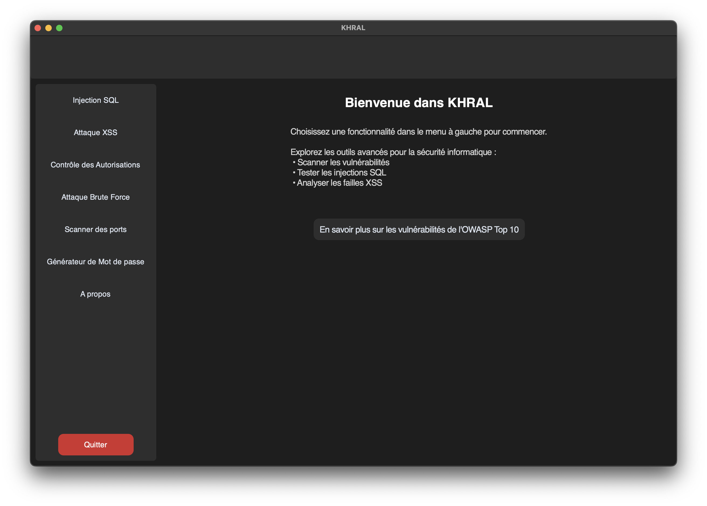
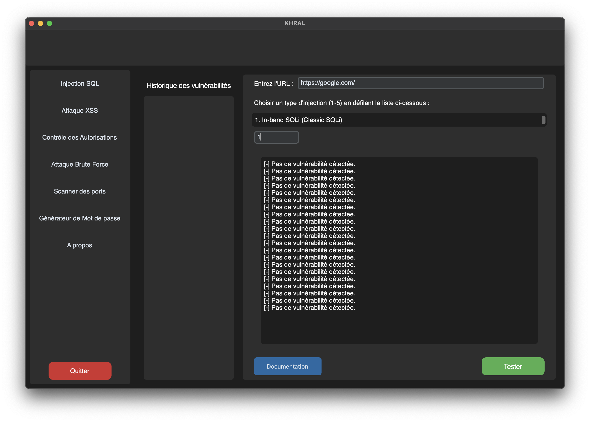
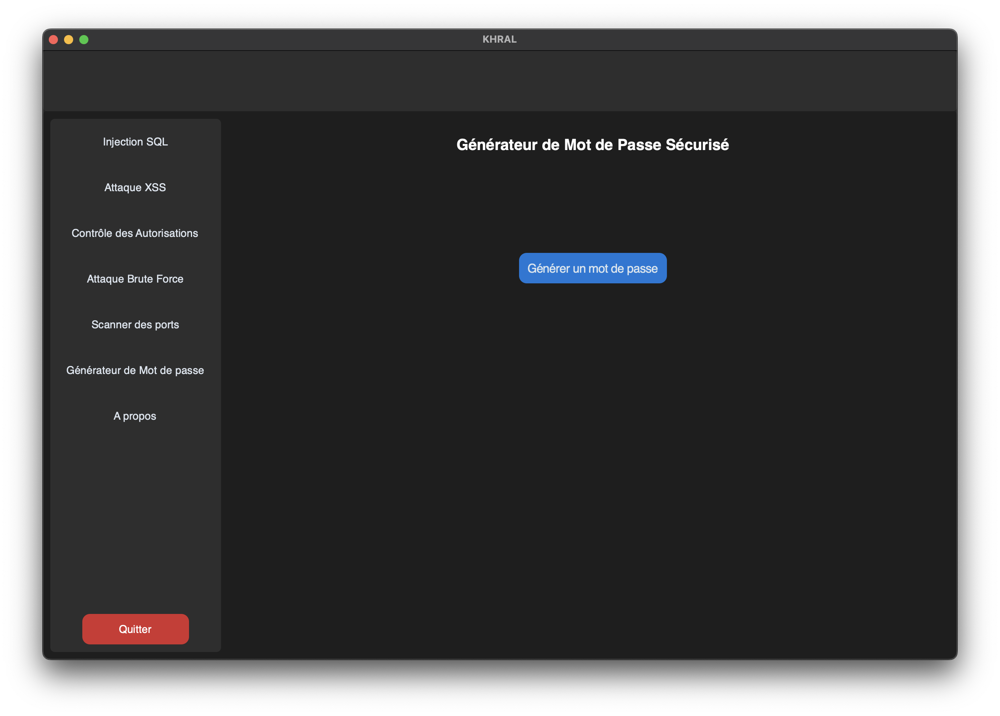

# **KHRAL - Outils de Tests de Vulnérabilités Web**

KHRAL est un outil conçu pour détecter, tester et exploiter certaines des vulnérabilités web les plus courantes, en se basant sur les directives du **Top 10 OWASP**. Ce projet vise à fournir aux utilisateurs des outils personnalisés pour les tests d'intrusion, tout en offrant une meilleure compréhension des méthodologies de pentesting.

Grâce à **KHRAL**, les testeurs de sécurité et développeurs peuvent identifier les failles de sécurité présentes dans leurs applications web et améliorer la robustesse de leur code face aux attaques.

---



---
## ⚠️ Message de Prévention

### Usage Responsable
Ce projet est conçu uniquement à des fins éducatives, de recherche en cybersécurité et de tests autorisés sur vos propres systèmes ou ceux pour lesquels vous avez une autorisation explicite. Toute utilisation abusive ou non autorisée peut être illégale et entraîner des sanctions pénales.

### Rappels Importants :
1. **Respect de la Loi** : L’utilisation de cet outil sur des systèmes sans autorisation préalable est strictement interdite par la loi.  
2. **Éthique en Cybersécurité** : En tant que professionnel ou apprenti en cybersécurité, votre responsabilité est de protéger les systèmes et non de les compromettre.  
3. **Responsabilité** : L'auteur de ce projet décline toute responsabilité en cas de mauvaise utilisation de cet outil.

### Recommandations :
- Testez uniquement vos propres systèmes ou ceux pour lesquels vous avez obtenu un consentement écrit.  
- Consultez les réglementations locales et internationales concernant les tests de sécurité et les activités de cybersécurité.

---

## **Fonctionnalités**

### 🔍 Tests de vulnérabilités OWASP 
1. **Injection SQL** : 
   - Identifie les points vulnérables aux injections SQL en analysant les paramètres d'URL ou de requête.  
   - Exploitation basique avec des chaînes SQL malveillantes.


2. **Cross-Site Scripting (XSS)** :
   - Détecte les failles XSS dans les champs de saisie utilisateur et les paramètres d'URL.
   - Teste automatiquement l'exécution de scripts JavaScript malveillants.

3. **Broken Access Control** *(En développement)* :
   - Analyse les restrictions d'accès inadéquates ou contournées.
   - Teste les autorisations manquantes ou mal configurées.

  

4. **Identification and Authentication Failures** *(Utilisation de d'attaque Brute Force)* :
   - Évalue la robustesse des mécanismes d’authentification en simulant des attaques par Brute Force.
   - Identifie les failles dans la configuration des autorisations et les mécanismes de contrôle d’accès.
  

---
## **Autres Fonctionnalités**
1. **Scanner Réseau** :
   - Permet de cartographier les serveurs web et services actifs.
   - Identifie les points d'entrée potentiels pour d'autres tests.
  

  
2. **Générateur de mot de passe dans un trousseau** :
   - Génère des mots de passe sécurisés et uniques en fonction des paramètres définis par l’utilisateur.
   - Stocke et gère les mots de passe dans un trousseau local sécurisé pour une utilisation ultérieure.


--- 


### 🖥️ Interface Graphique Moderne

- **Navigation intuitive** : 
  - Interface utilisateur ergonomique développée avec **CustomTkinter**, permettant une navigation fluide entre les outils.
  - Possibilité de passer rapidement d'un test à un autre grâce à une interface modulaire et réactive.

- **Visualisation des résultats** : 
  - Retour clair des résultats des tests.
  - Messages détaillés en cas de succès ou d'échec des attaques simulées.

---

## **Technologies Utilisées**

- **Langage principal** : Python 3.x
- **Framework UI** : [CustomTkinter](https://customtkinter.tomschimansky.com/)
- **Bibliothèques complémentaires** :
  - `requests` : Gestion des requêtes HTTP pour les tests d'attaques.
  - `concurrent.futures` : Implémentation multithread pour accélérer les tests.
  - `itertools` : Gestion des itérations et des données.
- **Documentation** : Conforme aux standards OWASP et aux méthodologies de pentesting.

---

## **Installation**

1. **Cloner le projet** :  
   ```bash
   git clone https://github.com/votre-repo/KHRAL.git
   cd KHRAL
   ```
2. **Crée un environnement virtuel et activez-le (optionnel mais recommandé)** :
bash

```bash
python3 -m venv env
source env/bin/activate  # Sur macOS/Linux
env\Scripts\activate     # Sur Windows
```
3.	**Installer les dépendances** :
Assurez-vous que Python est installé (version 3.8+). Ensuite, exécutez :
   ```bash
   pip install -r requirements.txt
   pip install -r requirementslinux.txt # Pour ceux qui sont sur une distrib Ubuntu/Linux
   ```
4.	**Lancer l’application** :
   ```bash
   python src/main.py
   ```

Cela ouvrira une fenêtre graphique avec les différents outils de tests de vulnérabilités.

## Contribuer

Si vous souhaitez contribuer à ce projet, voici les étapes à suivre :

1. **Fork le repository**.
2. **Crée une branche pour tes nouvelles fonctionnalités** :
```bash
git checkout -b feature/nom_de_fonctionnalité
```
3. **Commite tes changements :**
Copier le code
```bash
git commit -am 'Ajout d'une nouvelle fonctionnalité'
```
4. **Pousse sur la branche :**
Copier le code
```bash
git push origin feature/nom_de_fonctionnalité
```
5. **Ouvre une Pull Request sur le repository principal.**
## Auteurs
- Karim ABDALLAH - @abdhkarim
- Haroun Rachid LAZHARI - @CambouiMan

### Objectifs à Court Terme

- Finaliser l’outil de test pour le **Generateur de mot de passe**.
- Finaliser l’outil de test pour le **Scanner de port (NMap)**.
- Renforcer la documentation pour les **utilisateurs débutants**.
  
## Liens utiles
- [OWASP WSTG](https://owasp.org/www-project-web-security-testing-guide/v42/)
- [OWASP Top 10](https://owasp.org/Top10/fr/)
- [MITRE ATT&CK](https://attack.mitre.org/)
- [NIST CVE](https://nvd.nist.gov/vuln)

